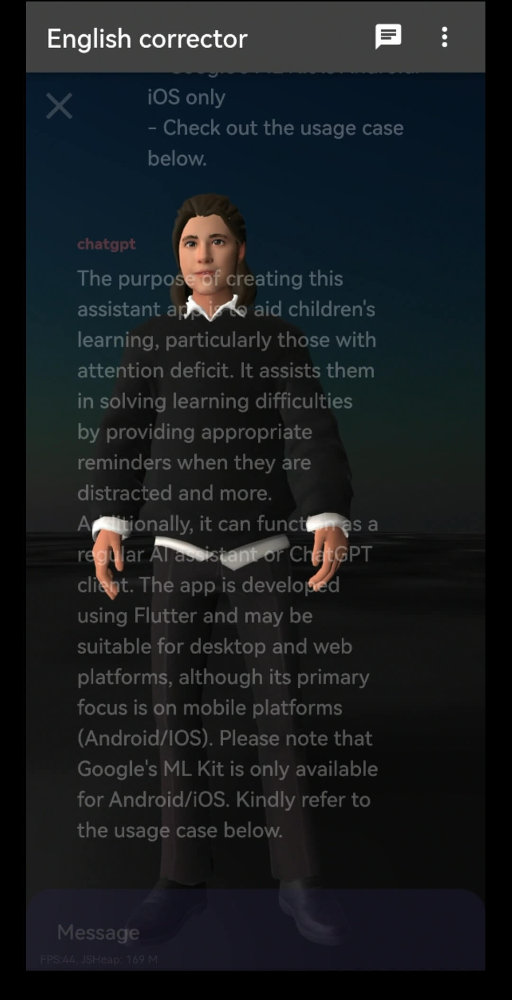

# See
## Incroduction
- The purpose of creating this assistant app is to aid children's learning, particularly those with attention deficit. 
- It assists them in solving learning difficulties by providing appropriate reminders when they are distracted and more. 
- Additionally, it can function as a regular AI assistant or ChatGPT client. 
- The app is developed using Flutter and may be suitable for desktop and web platforms, although its primary focus is on mobile platforms (Android/IOS). 
	- Please note that Google's ML Kit is only available for Android/iOS. 
- Kindly refer to the usage case below.

	- Video Demo
		- https://www.bilibili.com/video/BV1gs4y127An
	- Image preview

## Usage 

### 1 Install server

Refer to:
https://github.com/see2023/see_proxy

### 2 Install App

* Compile
`
cp ./lib/data/constants.dart.example ./lib/data/constants.dart
`
* Or download the release version

### Tips
- Camera Observer
	- Sitting posture(So far it's mostly head angles) and smile index were obtained from the front camera (no pictures were stored) to judge their current learning status
	- AI Reply
		- Enabled: Send the data above to ChatGPT or a similar interface and let it remind the person in front of the camera.
		- Disabled: Use the fixed strategy to remind the person in front of the camera.
- Voice Reply
	- Auto Play
		- Enabled: Automatically play the voice reply after the AI reply is completed.
	- Tap to play
		- Enabled: Single tap or double tap the message to play the voice from Azure TTS, and show 3d avatar animation.
- See Proxy:
	- Your own server address to proxy chatgpt and azure tts
	- Key: Your own key setted in the server(redis), you can share it with your family or friends
- Prompts setting:
	- Select or edit your own prompts in current dialog
	- The first one is used as the background reminder

## TODO
- AI delegated strategy optimization
	- Send tagged data to chatgpt, get response
		- Something like Auto-GPT, but I don’t have the chatgpt4 API permission, and gpt-3.5-turbo just makes me feel annoyed.
- Fixed strategy
	- Better reminder strategy
		- From camera data
	- Voice observer
		- Listen to his voice and analyze the content and his status
			- The best strategy I've found offline so far is to make him read aloud while he's doing homework
- Avatar
	- Isolate avatar(mesh) from basic animations
	- Support online avatar link from readyplayer.me or other avatar platform
		- Decorative/Texure configuration
		- Voice match
- Animation
	- More and better animations
	- Real-time animation
		- From camera data
		- From voice data
- Better interaction
	- Better voice input
- IOS and other phones/platforms
	- Tested on Android: Kirin 990, HarmonyOS 2.0(Android 10.0), 8G RAM
- Reduce token consumption
- Reduce energy consumption

## Thanks
As a back-end developer in a traditional industry, this is my first attempt at developing a mobile app, which also involves a lot of AI and 3D related knowledge. 
Thanks for the support of New Bing and various projects and organizations below:
- Flutter related
	- get
		- Saved a little from a pile of shit -_-
	- flutter_chat_ui
	- isar & hive
	- many more in [dependencies](./pubspec.yaml)
- AI related
	- openai
	- azure tts
	- google ml kit
	- https://prompts.chat/
- Avatar related
	- https://github.com/BabylonJS/Babylon.js
	- https://readyplayer.me/
	- https://www.mixamo.com/
	- https://www.blender.org/

## DISCUSSION
Please go to the github discussion area

## LICENSE
Copy from the components used [license](./LICENSE)
